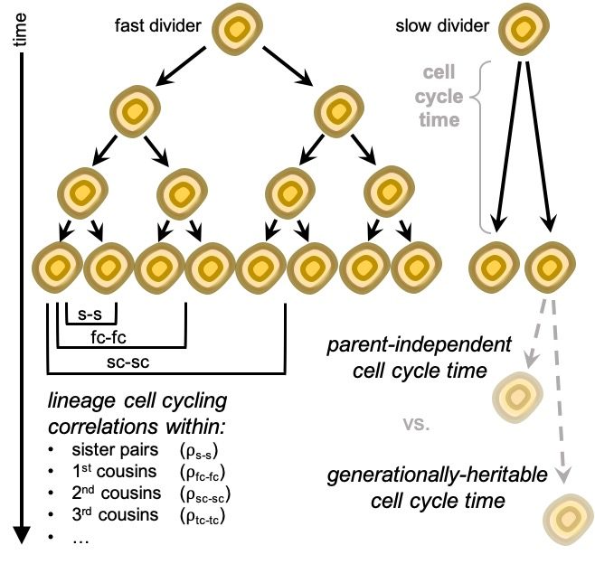
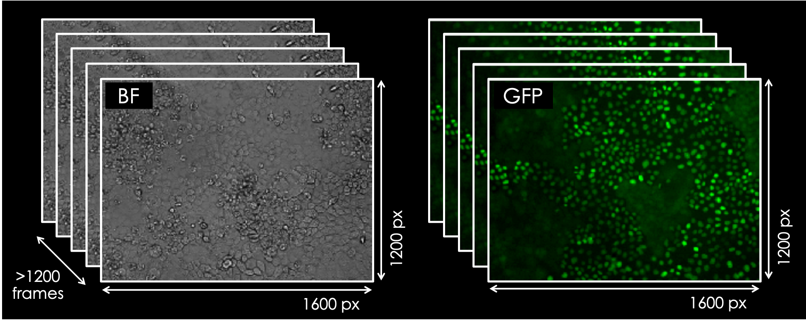
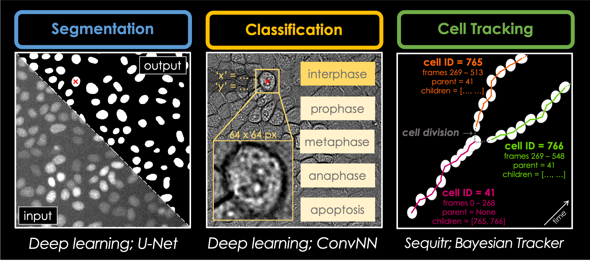

# *CellComp* 🧫: Giving Single Cells a Story… 📜

Welcome to my GitHub *CellComp* repository 🥳, where you’ll find various Python packages 🐍 related to my PhD thesis project 📚 at the interface of cancer cell biology, machine learning and computational biophysics. In my research, **I focus on the automated deep lineage analysis & single cell cycling duration prediction 🧫 within non-/cancer populations.** With the aid of wide-field & fluorescence microscopy 🔬, deep learning-mediated image segmentation 🖼️ & automated cell tracking tools 👣, I am identifying proliferation & differentiation characteristics 📈 which predispose cells to acquire 'fast divider' properties, which could serve as good predictors of the *stemness* of the cell 🧬. For a more-detailed description of my PhD research project 📚, my previous research experience 🥼 & completed training courses 🏫, check out [my CV](https://github.com/KristinaUlicna/KristinaUlicna/blob/master/CV_Kristina_Ulicna.pdf "Kristina's Curriculum Vitae") 📄 or [my LinkedIn profile](https://www.linkedin.com/in/kristinaulicna/ "Kristina's LinkedIn Profile") for more details. 


## *Note:* This page is currently under reconstruction 🚧

The *CellComp* repository was dedicated to describe my research aims & intentions prior to the pandemic situation 😷🦠🌡️. I was awarded a full scholarship by the [UCL-Yale Collaborative Programme](https://www.linkedin.com/posts/kristinaulicna_cancerbiology-stemcells-deeplearning-activity-6666317111033503744-e2w3 "UCL-Yale Collaborative Programme") to visit **Yale School of Medicine** & collaborate with the research team lead by [Dr Shangqin Guo](http://www.guolab.net/ "Guo Lab at Yale") to obtain microscopy datasets of differentiated / reprogrammed stem-like cell lines. However, due to the current situation, I had to postpone my research exchange with **Yale Stem Cell Center** for later & diverge from my original project interests. I'm currently shortlisting the priorities for the rest of my PhD with a strong computational component 👩‍💻, so *please bear with me while I do so* 😉.


---
## PhD Project 👩‍🔬: Single-Cell Heterogeneity within Non-/Cancer Populations 🧬

### What do we want to achieve? *(Rationale)*

Cancer is a dynamic disease during the course of which populations of cells within the tumour become more *heterogeneous*, meaning that bulk tumours include a diverse collection of cells harbouring distinct molecular signatures. These lead to differences in responses to various environmental cues, growth and/or apoptotic signals, immuno-surveillance and differential levels of sensitivity to treatment [[1]](https://www.nature.com/articles/nrclinonc.2017.166.pdf).

Exactly how this heterogeneity is achieved within the tumour is, however, not clear. Although the answer to this question is still a topic of scientific debate, two main hypotheses prevail; in the ***cancer stem cell hypothesis*** the organ-associated adult stem cells are believed to acquire tumourigenic and/or agressive properties and populate tumours by fast, unregulated divisions. In contrast, in the ***clonal evolution hypothesis*** all cells in the specific organ start with identical potential to populate tumours, but those with shorter division time will result in producing more progeny, which increases their chances to acquire cancer-triggering mutations, leading to spontaneous tumour initiation [[2]](https://www.tandfonline.com/doi/pdf/10.4161/cc.6.19.4914?needAccess=true).

Although multiple pieces of scientific evidence play in favour of either of these hypotheses, it is not perfectly clear which one of the hypotheses is correct. To gain a better insight into the early mechanisms of tumour initiation, it is crucial to **study cancer cell populations with single cell level precision**. That is because the behaviour, responses and generational heritability of certain factors which make the cancer initiatiors the cancer initiatiors may be averaged out in so-called population averaging experiments (i.e. Western blots for protein expressions, confluency-based experiments to test chemotherapeutic agents, RNA-Seq for gene transcription screenings, etc.) [3].

 **Figure 1 | Single Cell Cycling Heterogeneity in Non-/Cancer Population.** More details about our research motivation & objectives to be found in our recent [bioRxiv preprint](https://www.biorxiv.org/content/10.1101/2020.09.10.276980v1.full "Automated deep lineage tree analysis using a Bayesian single cell tracking approach"): "*Automated deep lineage tree analysis using a Bayesian single cell tracking approach" (2020)*".


### What are we doing to achieve it? *(Methods)*

####*The Laboratory Part* (wet-lab):
In our group, we have developed (and are still improving!) a fully automated pipeline to analyse long-term (up to 120 hours) *time-lapse microscopy movies of fluorescently-labelled live cells*. We utilise wide-field microscopy to monitor MDCK (Madin-Darby Canine Kidney) cells of mammalian origin by acquiring an image of the field of view every 4 minutes (= frame rate), watching the cell populations growing in culture from low to high confluency. In parallel to that, we use fluorescent microscopy channels to capture the movement of tagged nuclear protein reporters (e.g. histone H2B) in cell culture.


 **Figure 2 | Acquisition of live-cell imaging data via time-lapse microscopy.**
***(Left)*** Bright field image capturing the field of view (1600 x 1200 px) of MDCK cells on a confluent plate. The sequential nature of taking images with pre-defined frame rate (4 minutes) for the duration of up to 120 hours per single experiment is depicted.
***(Right)*** Fluorescent channel image of MDCK cells transfected with GFP-tagged histone H2B protein to visualise cell nucleus. Each fluorescent image corresponds to the respective bright field image throughout the entire duration of the movie. Image scale: 3 pxs = 1µm.


####*The Computational Part* (dry-lab):
These movies represent an input to our image analysis pipeline, detailed in Figure X. Our pipeline, which ulitises deep learning & artificial neural networks architectures, consists of image segmentation & nuclei localisation (A), followed by cell cycle phase classification (B). The combination of these information is then supplied into our state-of-the-art automated cell tracker (C), which has the capacity to connect individual cells across multiple frames into tracklets, *revealing their migration trajectory*, and to account for cell division and cell death events, *monitoring the whole lineage of individual cells across multiple generations* throughout the movie, as illustrated in Figure X.

 **Figure 3 | Flowchart of our custom-made deep learning-based fully automated movie analysis pipeline.**
***(Left)*** Alignment of the input and output of U-Net, an artificial neural network architecture which we utilise to segment cell nuclei based on the readout of the fluorescent tag from the fluorescent channel (=input image; lower left triangle). The segmentation produces a binary map (=output image; upper right triangle), which is of identical dimensions to the entry image with pixel values of either 0 (=background, black) or 1 (=cell nucleus, white). In addition, all objects scored as cells are localised for their centroids (represented as the red cross), which marks the location of the cell nucleus on the 'x' and 'y' axes.
***(Centre)*** Use of an artificial convolutional neural network (CNN) for classification of the interphase, prometaphase, metaphase, anaphase (all phases of the cell cycle) or apoptosis (programmed cell death) of the single cell with known location. The CNN uses the coordinates from the previous step and the corresponding bright field image (i.e. at the identical frame of the movie) and crops a 64 x 64 px image around the identified 'x' and 'y' coordinates which is then supplied as an output to predict the probability score of the respective cell to be in the above-mentioned phases of the cell cycle / apoptosis.
***(Right)*** Principle behind the fully automated cell tracking tool, Bayesian Tracker, which uses the localisation and classification information to (i) connect cells into tracklets to reveal their real-time trajectories and (ii) account for cell division / cell death events. In the depicted example, cell ID '41' (magenta) which migrated a certain distance between frames #1 & #10 was re-connected by the tracker (magenta lines) and identified to have divided into cell ID '765' (orange) and cell ID '766' (green), which in turn migrated further and their trajectories were re-connected (orange and green lines, respectively).


#### *What is this good for?*
In this way, we can map the behaviour of single cells and identify outliers based on chosen parameters, e.g. cell cycle duration (or doubling time). We can study whether the cell cycle duration is a heritable property across multiple generations, whether the increasing local cell density impacts the cell doubling time, or whether cells tend to migrate towards free space areas in the culture vessel when critical local cell density is reached. Not only we can monitor the cells in their natural cell culture environment, but also their responses to culture conditions perturbations, chemotherapeutic treatment agents and differentiating factors. The vast amount of data generated by cell tracking therefore represents a source for answers to many interesting biological questions... 😉


### What did we achieve so far? *(Results)*

*Are you still here reading this...?* 😮Wow!  I did not expect that... 👍If you're curious about our preliminary results & would like to know more details about where our analysis pipeline has lead us, please get in touch via [email](mailto:kristina.smith.ulicna@gmail.com "Click to Email Me") or send me a message on [LinkedIn](https://www.linkedin.com/in/kristinaulicna/ "Kristina's LinkedIn Profile"). I'm more than happy to talk you through what we've found so far... 💬


### References

+ [[1]](https://www.nature.com/articles/nrclinonc.2017.166.pdf) - Tumour Heterogeneity and Resistance to Cancer Therapies (Dagogo-Jack & Shaw)

+ [[2]](https://www.tandfonline.com/doi/pdf/10.4161/cc.6.19.4914?needAccess=true) -
Breast Tumor Heterogeneity: Cancer Stem Cells or Clonal Evolution? (Campbell & Polyak)


## Repository Structure: Getting Started

### Packages & Libraries

WORK IN PROGRESS (Last update: 06/10/2020).
_Note: this is not the full repository (yet)_. I am currently restructuring my repo, so please bear with me while I do so (and wish me luck!).

### Prerequisites & Dependencies Installation

All code in the *CellComp* repository is written in Python and has been tested with Python 3.7+ on OS X. Most of the packages require the following additional packages, namely `numpy, scipy, h5py, matplotlib.pyplot, plotly, time`. For convenience, you can just run the following code to install all the dependencies:

`$ pip install -r requirements.txt`


### Authors, Acknowledgments & Credits

The code committed to this repository was written by Kristina Ulicna (see the [LICENSE.md](../LICENSE.md "Kristina's LICENSE.md file") for more details) and sources from the BayesianTracker library ([Tracker on Github](https://github.com/quantumjot/BayesianTracker "Bayesian Tracker Repository" )), which is part of the *Sequitr* image processing toolbox for microscopy data analysis, developed by my PhD project advisor, Dr Alan R. Lowe at UCL ([Sequitr on GitHub](https://github.com/quantumjot/sequitr "Sequitr Repository")). For more information see our [CellX group website](http://lowe.cs.ucl.ac.uk/cellx.html "CellX group website").


### Project status: _WORK IN PROGRESS_

I have joined the [CellX group](http://lowe.cs.ucl.ac.uk/cellx.html  "CellX group website") in late March 2019 for my PhD rotation and have contributed to the project since. I am currently in my 2nd year of the PhD programme at the BBSRC-funded _London Interdisciplinary Doctoral (LIDo) Consortium_ at University College London (UCL). **I am currently in search for PhD internship / placement opportunities in software development and/or machine learning in a health-oriented established company.** If you are interested in getting in touch, please contact me directly via [email](mailto:kristina.smith.ulicna@gmail.com "Click to Email Me") or check out my [LinkedIn](https://www.linkedin.com/in/kristinaulicna/ "Kristina's LinkedIn Profile") profile.


---
### Citation

More details about my recent publication focussed on single-cell tracking approach from time-lapse microscopy data can be found in my [*DeepTree repository*](https://github.com/KristinaUlicna/DeepTree "DeepTree repository") or in the following publication:

**Automated deep lineage tree analysis using a Bayesian single cell tracking approach**  
Ulicna K, Vallardi G, Charras G and Lowe AR.  
*bioRxiv* (2020)  
<https://www.biorxiv.org/content/early/2020/09/10/2020.09.10.276980>

```
@article {Ulicna2020.09.10.276980,
  author = {Ulicna, Kristina and Vallardi, Giulia and Charras, Guillaume and Lowe, Alan R.},
  title = {Automated deep lineage tree analysis using a Bayesian single cell tracking approach},
  elocation-id = {2020.09.10.276980},
  year = {2020},
  doi = {10.1101/2020.09.10.276980},
  publisher = {Cold Spring Harbor Laboratory},
  URL = {https://www.biorxiv.org/content/early/2020/09/10/2020.09.10.276980},
  eprint = {https://www.biorxiv.org/content/early/2020/09/10/2020.09.10.276980.full.pdf},
  journal = {bioRxiv}
}
```


