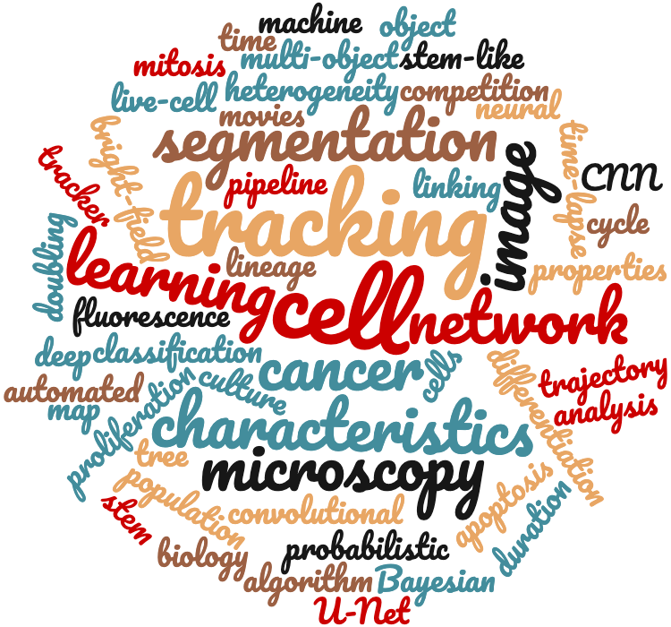

# *CellComp* 🧫: Giving Single Cells a Story… 📜

Welcome to my GitHub *CellComp* repository, where you’ll find various Python packages 🐍 related to my PhD project 📚 at the interface of cancer cell biology, machine learning and software development. **In my research, I focus on the identification of stem-like cells 🧫 within non-/cancer cell populations.** With the aid of wide-field & fluorescence microscopy 🔬, deep learning-mediated image segmentation 🖼️ & automated cell tracking 👣, I am identifying proliferation & differentiation characteristics 📈 which could serve as good predictors of the *stemness* of the cell 🧬. For a more-detailed description of my PhD research, my previous research experience and my training courses, please click on my [LinkedIn profile](https://www.linkedin.com/in/kristinaulicna/). 

## PhD Project 👩‍🔬: Heterogeneity within Non-/Cancer Cell Populations 

In this section, you will find my code divided into these sections: 

- _(collaborative)_ **Sequitr_Tracker:** my contribution towards a collaborative development of our fully automated movie analysis pipeline for computational processing of the fluorescence movies !!!our 👩‍💻 fully automated time-lapse movie analysis pipeline !!!
- _(independent)_ **Stem_Analysis:** development of pipeline to evaluate the behaviour of cells (division or programmed cell death) captured per single imaging period
- _(independent)_  **Stem_Analysis:** building of automated tools to extract information (such as cell cycle time, local cell density, intrinsic oscillations, etc.) to identify stem-like cells in cell populations

## Getting Started

### Prerequisites / Dependencies

All code in the *CellComp* repository is written in Python and has been tested with Python 3.7+ on OS X. Most of the packages require the following additional packages:

+ Numpy
+ Scipy
+ h5py
+ matplotlib.pyplot
+ time

### Installation & Usage

Alternatively, to install all the dependencies, run:

`$ pip install -r requirements.txt`

### Authors, Acknowledgments & Credits

The code committed to this repository was written by Kristina Ulicna (see the LICENSE.md for more details) and sources from the BayesianTracker library ([Tracker on Github](https://github.com/quantumjot/BayesianTracker)), which is part of the *Sequitr* image processing toolbox for microscopy data analysis, developed by my PhD project advisor, Dr Alan R. Lowe at UCL ([Sequitr on GitHub](https://github.com/quantumjot/sequitr)). For more information see our [CellX group website](http://lowe.cs.ucl.ac.uk/cellx.html).

### Project status: _WORK IN PROGRESS_

I have joined the [CellX group](http://lowe.cs.ucl.ac.uk/cellx.html) in late March 2019 for my PhD rotation and have contributed to the project since. I am currently in my 2nd year of the PhD programme at the BBSRC-funded _London Interdisciplinary Doctoral (LIDo) Consortium_ at University College London (UCL). **I am currently in search for PhD internship / placement opportunities in software development and/or machine learning in a health-oriented established company.** If you are interested in getting in touch, please contact me directly via [email](mailto:kristina.smith.ulicna@gmail.com) or check out my [LinkedIn](https://www.linkedin.com/in/kristinaulicna/) profile. 

